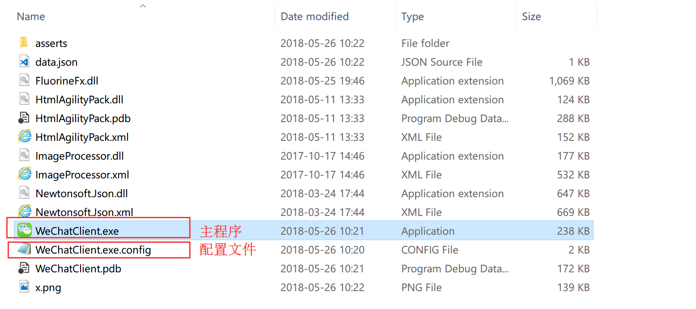
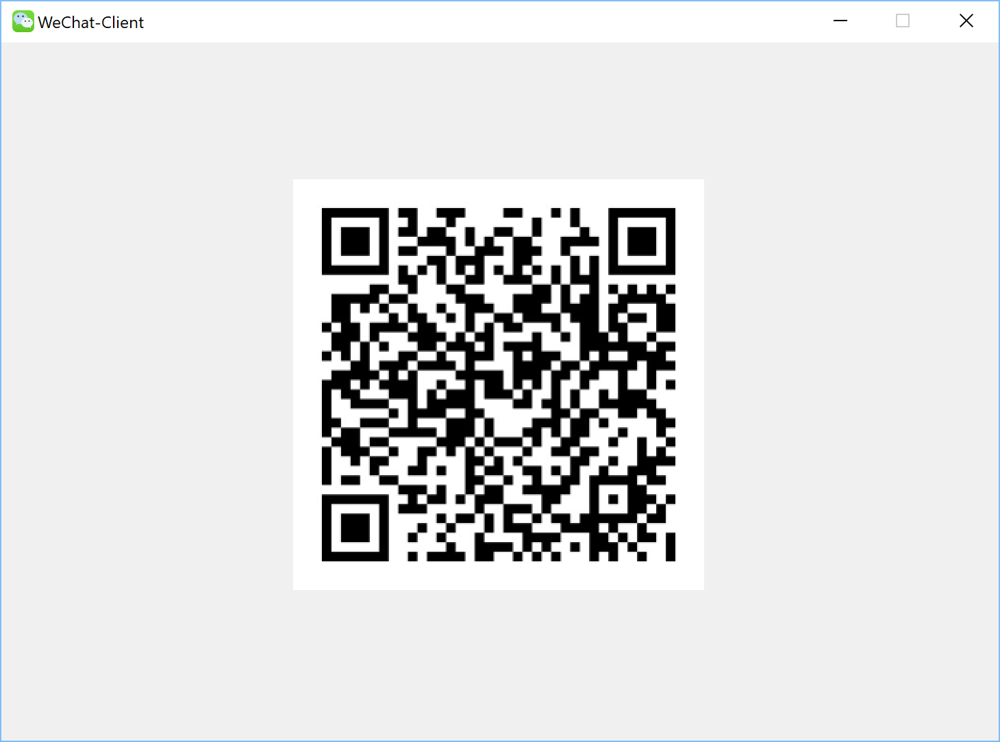
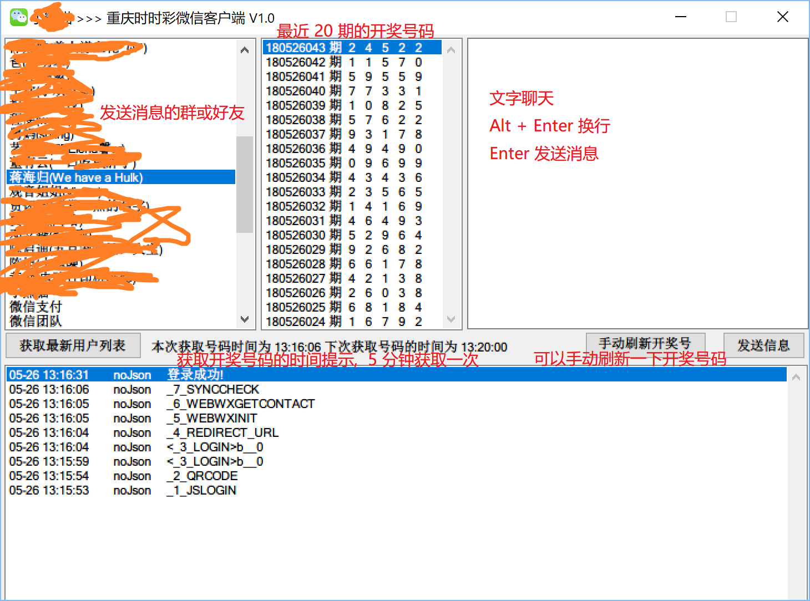

# 微信模拟客户端

> 定时发送图片到微信群或好友

## 1. 软件主程序以及配置文件

## 2. 双击 WeChatClient.exe, 用手术微信扫描二维码后登录

## 3. 登录之后可以看到好友和时时彩等内容, 时时彩会检测并自动发送

## 4. 感谢

该软件的原始开源项目 [HttpSocket](https://gitee.com/lxwcode/weixinHttpApi2.0)
